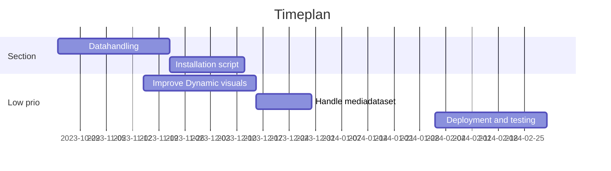

# Twin City Platform 🏡

Copyright 2024, Linköping University, All rights reserved.

**Version:** 1.0.1

*Product Owner:* Erik Junholm
*Tech lead:* Erik Junholm  

**Developers:** David Beuger, Anders Kettisen  
**Hall of Fame:** Mikael Pettersson

This is the home of the Digital Twin project.

# Specification
- Coordinate system : SWEREF99TM 16 30 00
- Extent Nkpg
  - Min X: 129411,400, Y: 6495015,262 
  - Max X: 134211.400, Y: 6498915,262
  
- Scale : 1:1500

## Build & Run

This project has been built and tested on:
- Windows
- Unreal Engine 5.1.1
- Visual Studio 2019

## Plugins

The GeoReferencing plugin from UE 5.1.1 is currently used in the Digital Twin.

## Dependencies

- SimStad traffic server: [SimStad Traffic Server](https://gitlab.liu.se/Exploranation/City/simstad-repos/utils/trafficserver/digitaltwin-norrkoeping-utils)

## Roadmap

# Third Party

- Zmq-plugin: [ZmqPluginforUnreal](https://gitlab.liu.se/Exploranation/City/)
