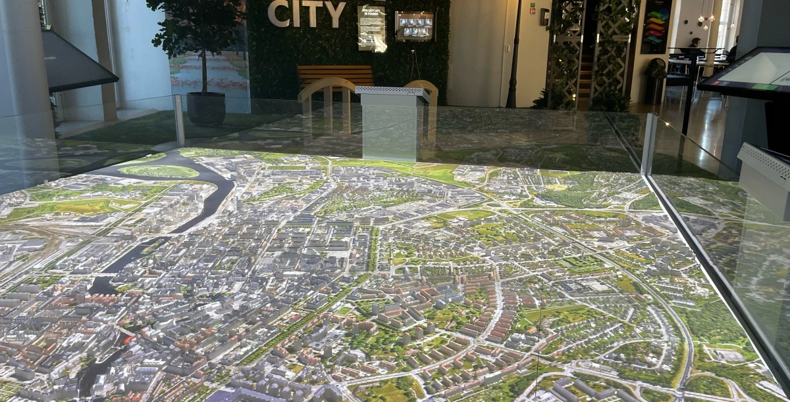
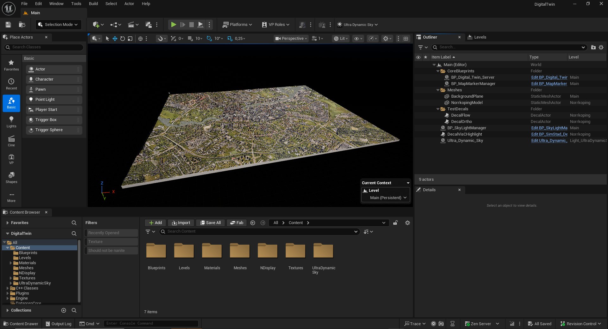

# Digital Twin City Platform 🏡

Copyright 2024, Linköping University, All rights reserved.

This is the home of the project Digital City Twin Platform.

# Norrköping example specification
- Coordinate system : SWEREF99TM 16 30 00
- Extent Nkpg
  - Xmax  = 134436,815
  - Ymax  = 6498924,439
  - Xmin  =  129316,815
  - Ymin  = 6495084,439 
- Scale : 1:1500

# Build & Run
This project has been built and tested on:
- Windows
- Unreal Engine 5.6.0
- Visual Studio 2022

# Plugins/Dependencies
The application has some necessary free plugins and some optional paid plugins. 
You need to add this to the project yourself on the public branch since we are not allowed to distribute them freely.

## Ultra Dynamic Sky
[Ultra Dynamic Sky](https://www.fab.com/listings/84fda27a-c79f-49c9-8458-82401fb37cfb) is a paid plugin that we use for improved sky light simulation. 
It is not necessary for the application and can be replaced with the free SunPosition plugin.
If you want to use UDS, buy the product and add it directly under the Content Folder. It is not a standalone plugin but rather a content collection.
If you want to omit UDS, you just need to fix some compile errors.
In the SkylightManager, you will find two functions *SetUltraDynamicSkyIntensityFromCmd* and *UpdateUltraDynamicSky* that attempts to call the UltraDynamicSky blueprint.
Remove these, and set *UpdateSkylightFromData* to use *UpdateSunSky* instead.
Also make sure to remove the *Light_UltraDynamicSky* sublevel and replace it with *Light_SunSky*. Remember to change the streaming method of the Level to Always Loaded.

## NDI plugin
This plugin is needed to receive streams such as traffic data via NDI. You can find it at [NDI plugin download](https://ndi.video/for-developers/ndi-unreal-engine-sdk/).
Then add it to the Plugins folder of the project.
This plugin is not optional and will cause compile errors if not present.

# Project overview

This Unreal Engine project is built with both C++ and Blueprint code.

## Controls
This application is completely controlled remotely and thus the Pawn, Player Controller and Game Mode are just placeholders to run the app.
 Web socket communication
All commands are received through a Web socket defined in *WebSocketSubsystem*, which sets up a link to the [Omni server](https://immvis.github.io/guides/omni/). Command are then processed and sent to *BP_Digital_Twin_Server* on the Blueprint side via event dispatchers.
Possible JSON requests are defined in the **repository Wiki**, which are parsed using the *CreateRequestStruct* function into structs defined in *RequestResponse.h*.
Requests are then handled in *BP_Digital_Twin_Server*, and in most cases a response is then sent back through the Web socket.

## Requests
All possible requests are defined in *RequestResponse.h*.
They are then processed by *BP_Digital_Twin_Server*.

## Layers
At the core of the application are layers, 2D decals that can be shown on top of the 3D model. The decal order is defined by the order of the input layer array.
Layers can be:
- Images
- Movies
- Flowmaps
- NDI streams
- Colors
Each layer can also be modified by parameters such as Emission, Opacity and Crop as well as more layer specific parameters. This allows for some interesting blending of layers.
Sending a new layer request will either wipe the existing ones or update parameters in the current layers, depending on the value of the *Flush* parameter.
If you want to add a decal in the editor that should always stay, add the actor tag "persistent" to that decal.

## Datasets
Most layers build from datasets, which currently means PNG and MP4. These are read from folders at game start up and loaded into memory, as the files are large and it is expensive to do this at runtime on demand.
The files are read from the Datasets folder, which can be set up in different ways. One way might be to set up a linked folder to a Google Drive, to keep files synced.
Should you want to update the datasets while running the app, you can call the Recache request to update the provided folder. This will update the given folder and any child folders recursively.

## Blueprints
The projects starts in the *Main* level. This is where the core functionality lives:
- *BP_Digital_Twin_Server* handles request and layer management
- *BP_MapMarkerManager* handles Map Markers specifically
- *BP_SkyLightManager* handles the Sky Light system

## Levels
*Main* also contains two sublevels that are Always loaded:
- *Norrkoping* is the example level where the model is placed. Replace this level with your own content in a similar fashion.
- *Light_UltraDynamicSky* contains the *UltraDynamicSky* content. Replace this with *Light_SunSky* if you have not installed *UltraDynamicSky*.

# Running the application on a 3D print
Transfer the packaged game folder to your projector computer. The .exe can't be run directly since you need to provide additional parameters.

## Startup script
The easiest is to run [the startup script](Simstad_Start_Script.ps1) provided that you change some of the parameters to match your setup and file locations.
The startup script runs 3 things in order
1. Traffic subscription
2. NDI publisher
3. Unreal application on a loop
1 and 2 are optional and can be run somewhere else, we just prefer to run it on the same computer.
3 runs on a loop since we want to safe guard some crashes that we have seen. If a crash occurs, it detects the exe not running and restarts it.

## .env
If you are using *Omni* you need to provide a token in the **.env** file that should be placed in the *root/DigitalTwin* folder.
Copy the file from the project folder and add your UUID.

## Datasets
In *root/DigitalTwin* you also need the *Datasets* folder. This folder should be the same content as described above.

## nDisplay
We are using [nDisplay](https://dev.epicgames.com/documentation/en-us/unreal-engine/ndisplay-overview-for-unreal-engine) to configure a camera setup that matches our real world projectors. The game camera is placed in the origo by default, so you either need to implement the same system or move the camera to your preferred location in the editor.
The advantages of using nDisplay are:
- Configure camera setup on packaged game without having to rebuild
- Allows multi camera/projector setups