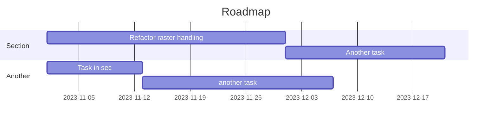

Twin City Platform 🏡
--
Version : 1.0
--
Tech lead : Erik Junholm
--
Hall of fame : Mikael Pettersson
--

This is the home of the Digital Twin project. 

# Build & Run
This project has been built and tested on 
- Windows 
- Unreal Engine 4.27
- Visual Studio 2019

# Plugins
The GeoReferencing plugin from UE 4.27 is currently used in the Digital Twin. 

# Roadmap

# Third Party
Zmq
